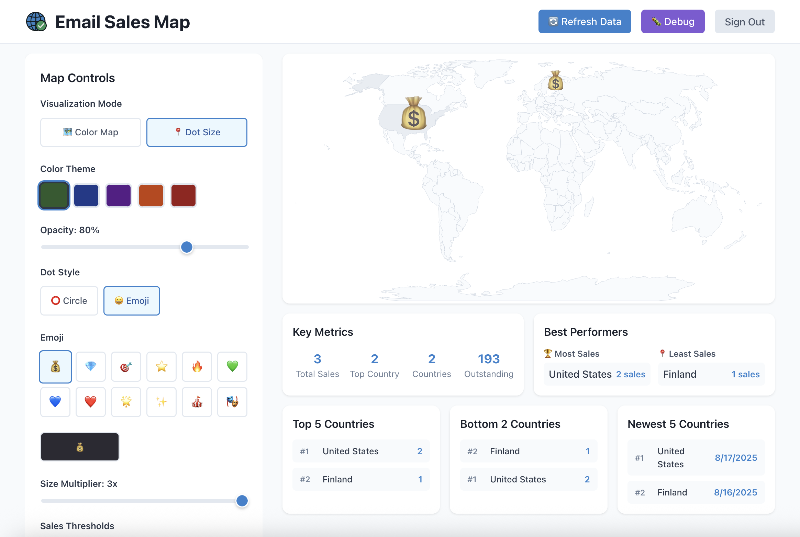

# Email Sales Map

Data visualization tool that authenticates with Google, reads specific emails from Gmail, aggregates country data, and displays it on an interactive world map.

## 🚀 Live App

The app should be live and usable here: https://mailsalesmap.org



## 🏗️ Architecture
- **Frontend**: React + TypeScript + Vite (served by Cloudflare Pages)
- **Backend**: Cloudflare Worker (handles OAuth and Gmail API)
- **Storage**: Cloudflare KV (sessions and caching)

## 🛠️ Local Development

### Quick Start
```bash
# Install dependencies for both frontend and backend
npm install

# Run both frontend and backend simultaneously
npm run dev

# Access the app at http://localhost:5173
```

### Manual Setup

#### 1. Prerequisites
- Node.js 18+
- Google Cloud Console project with OAuth 2.0 credentials

#### 2. Google Cloud Console Setup
1. Go to [Google Cloud Console](https://console.cloud.google.com/)
2. Create a new project or select existing one
3. Enable Gmail API
4. Go to **APIs & Services** → **Credentials**
5. Create **OAuth 2.0 Client ID** (Web application)
6. Add authorized origins:
   - `http://localhost:5173` (frontend)
   - `https://mailsalesmap.org` (production)
7. Add authorized redirect URIs:
   - `http://localhost:8787/api/auth/callback` (local backend)
   - `https://mailsalesmap.org/api/auth/callback` (production)

#### 3. Environment Configuration
Create `worker/.dev.vars` with your credentials:

```bash
# worker/.dev.vars
CLOUDFLARE_ACCOUNT_ID=your_cloudflare_account_id
CLOUDFLARE_API_TOKEN=your_cloudflare_api_token
GOOGLE_CLIENT_ID=your_google_client_id_here.apps.googleusercontent.com
GOOGLE_CLIENT_SECRET=GOCSPX-your_google_client_secret_here
GITHUB_TOKEN=your_github_token_here

# Environment configuration
ENVIRONMENT=development
```

**⚠️ Important**: Never commit `.dev.vars` to git - it contains secrets!

#### 4. Install Dependencies
```bash
# Root dependencies (for scripts)
npm install

# Frontend dependencies
cd frontend && npm install && cd ..

# Backend dependencies  
cd worker && npm install && cd ..
```

#### 5. Run Development Servers

**Option A: Run everything at once**
```bash
npm run dev
# This starts both frontend (localhost:5173) and backend (localhost:8787)
```

**Option B: Run separately**
```bash
# Terminal 1 - Backend
cd worker && npm run dev

# Terminal 2 - Frontend
cd frontend && npm run dev
```

#### 6. Access the Application
- **Frontend**: http://localhost:5173
- **Backend API**: http://localhost:8787/api/health
- **Login Flow**: Click login button on frontend → complete Google OAuth → redirected back to dashboard

### Build & Test
```bash
# Build both frontend and backend
npm run build

# Type check both projects
npm run type-check

# Lint both projects  
npm run lint
```

### Troubleshooting

#### OAuth Issues
- Ensure redirect URIs in Google Console match exactly: `http://localhost:8787/api/auth/callback`
- Check that `ENVIRONMENT=development` is set in `worker/.dev.vars`
- Verify your `GOOGLE_CLIENT_ID` and `GOOGLE_CLIENT_SECRET` are correct

#### CORS Issues
- Access the app via `http://localhost:5173` (frontend), not `localhost:8787` (backend)
- Frontend proxies API requests to backend automatically

#### Session Issues
- Clear browser cookies and restart both servers
- Check that KV namespaces are properly configured in `worker/wrangler.toml`
